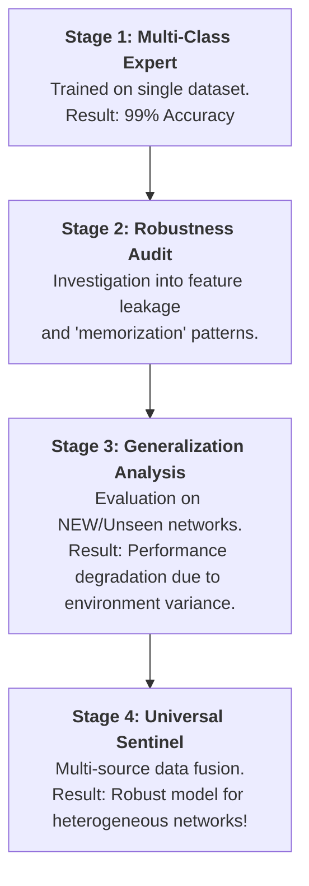

# Project Roadmap: Universal Botnet Detection

A high-level overview of the development stages, research outcomes, and project architecture.

---

## 🗺️ Project Development Pipeline

---

## 📋 Frequently Asked Questions (FAQ)

### 1. Functional Objective
- **Objective**: Deployment of an automated network security monitor.
- **Capabilities**: Identification and categorization of traffic as **Benign** (human-generated) or **Botnet-driven** (SYN, LDAP, UDP attacks).

### 2. Research Structure
The development process is documented across four specialized notebooks to follow the scientific method:
*   **Notebook 1**: Baseline AI model development.
*   **Notebook 2**: Robustness audit and "Leakage" identification.
*   **Notebook 3**: Generalization testing against real-world network variations.
*   **Notebook 4**: Final integration utilizing multi-dataset fusion (Universal Classifier).

### 3. Advantages of the Universal Classifier
- **Mechanism**: Training on diverse, cross-network datasets to learn underlying behavioral patterns rather than specific dataset artifacts.
- **Outcome**: Enhanced reliability and higher detection rates across varying network architectures and attack styles.

---

## 🚀 Key Outcomes
- **Detection Capabilities**: Identification of 3 primary cyber attack vectors.
- **Behavioral Analysis**: Focus on traffic timing and volume characteristics.
- **Cross-Network Stability**: Validated performance across multiple datasets and environments.

---

### Project Resources
- **Final Result Reference**: **[Botnet_Detection_Universal.ipynb](file:///c:/Users/vinay/botnetDetection_ML/Botnet_Detection_Universal.ipynb)**
